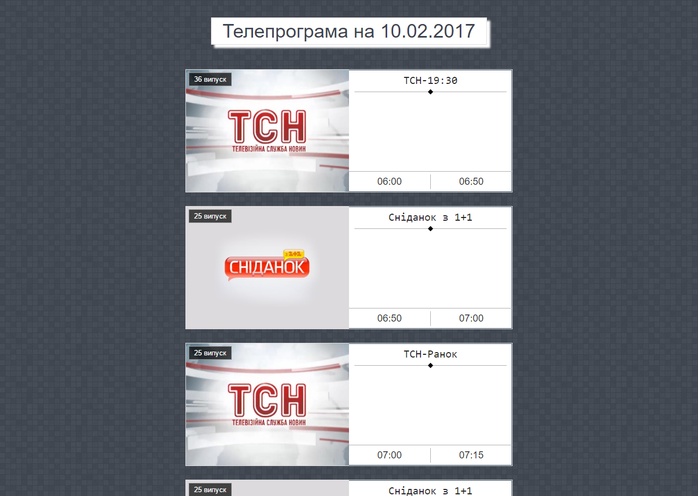

<h2>Завдання до хакатону:</h2>
Використовуючи https://api.ovva.tv згенерувати зображення, яке показує ТВ програму на поточний день для каналу "1+1" і розмістити його на обкладинці групи vk.com, або стіні группи.

<h2>Як зробити скриншот:</h2>
1. Згенерувати токен аккаунта - https://vk.com/dev/implicit_flow_user з доступом wall та groups.
2. В файлі "cron.php" замінити дані на свої, а саме токен аккаунта та группу. (Line: 8)
3. Відкрити файл "cron.php" в браузері і отримати новий запис в группі.

Note: Необхідно мати відкритий доступ до сайту.

<h2>Вигляд сайту:</h2>

